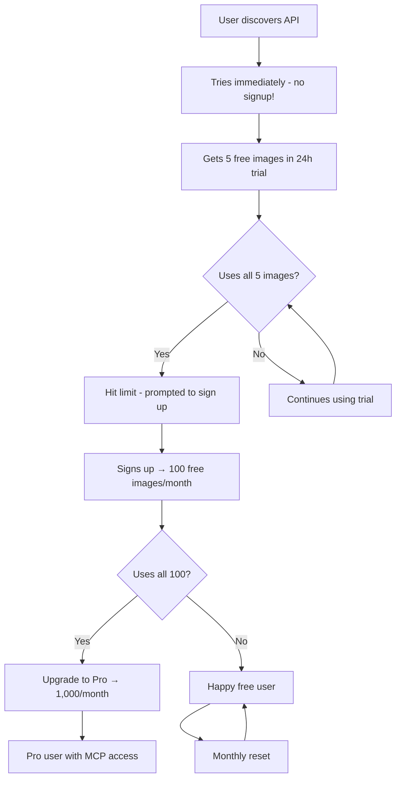

# 🚀 Freemium Trial System - Complete Implementation

## ✨ **Perfect Customer Journey**

### **Anonymous Trial → Sign Up → Upgrade**



## 🎯 **Multi-Interface Support**

### **1. REST API (No Auth Required!)**
```bash
# Try immediately - no signup needed!
curl -X POST https://stylize-mcp-server.com/stylize_image \
  -F "style_id=van_gogh" \
  -F "user_prompt=a beautiful landscape"

# Response includes trial info:
{
  "original_id": "req-123",
  "style": "van_gogh", 
  "stylized_image_url": "https://...",
  "trial_info": {
    "images_used": 1,
    "images_remaining": 4,
    "signup_message": "You have 4 free images remaining. Sign up for 100 free images per month!",
    "signup_url": "/auth/register"
  }
}
```

### **2. MCP Tools (Trial Enabled!)**
```python
# Start trial in MCP
result = await start_trial_session()
session_id = result["session_id"]  # e.g., "trial-abc123def456"

# Generate images with trial
result = await stylize_image(
    image_base64="...",
    style_id="van_gogh",
    session_id=session_id  # Use trial session
)

# Response includes trial tracking:
{
  "success": True,
  "stylized_image_url": "https://...",
  "trial_info": {
    "images_used": 1,
    "images_remaining": 4,
    "signup_message": "You have 4 free images remaining!"
  },
  "upgrade_options": [...] # When getting close to limit
}
```

### **3. Seamless Conversion Flow**
```bash
# When trial expires - convert to account
curl -X POST https://stylize-mcp-server.com/trial/convert \
  -H "Content-Type: application/json" \
  -d '{
    "session_id": "trial-abc123def456",
    "email": "user@example.com",
    "password": "securepass123",
    "first_name": "John",
    "last_name": "Doe"
  }'

# Gets JWT token + 100 free images immediately!
{
  "access_token": "eyJ...",
  "user": {
    "subscription_tier": "free",
    "trial_converted": true
  }
}
```

## 🎮 **MCP Integration Level: HIGH**

### **What Works in MCP:**
✅ **Trial Sessions**: `start_trial_session()` - Get session ID  
✅ **Image Generation**: Use `session_id` instead of `api_key`  
✅ **Usage Tracking**: See remaining images in real-time  
✅ **Upgrade Prompts**: Get pricing options when limit reached  
✅ **Status Checking**: `check_trial_status(session_id)`  

### **What Requires Web Interface:**
❌ **Payment Processing**: Credit card input (security/PCI compliance)  
❌ **Account Signup**: Email/password forms (UX complexity)  
❌ **Email Verification**: Link clicking (external action)  

### **Hybrid Approach:**
🔄 **MCP → Web handoff**: Tools return signup/payment URLs  
🔄 **Web → MCP return**: Users get API keys to continue in MCP  

## 💳 **Credit System Design**

### **Credit Packages**
```json
{
  "starter": {
    "credits": 50,
    "price": 9.99,
    "bonus": 5,
    "popular": false
  },
  "popular": {
    "credits": 200, 
    "price": 29.99,
    "bonus": 25,
    "popular": true
  },
  "pro": {
    "credits": 500,
    "price": 59.99, 
    "bonus": 75,
    "popular": false
  },
  "enterprise": {
    "credits": 1000,
    "price": 99.99,
    "bonus": 200,
    "popular": false
  }
}
```

### **Usage Tiers**
| Tier | Monthly Images | API Keys | MCP Access | Price |
|------|---------------|----------|------------|--------|
| **Trial** | 5 (24h) | ❌ | ❌ | Free |
| **Free** | 100 | 1 | ❌ | Free |
| **Pro** | 1,000 | 5 | ✅ | $19/mo |
| **Enterprise** | 10,000 | ∞ | ✅ | $99/mo |
| **Credits** | Pay-per-use | Based on tier | Based on tier | $0.10-0.20/image |

## 🛠️ **Implementation Architecture**

### **Trial Service Features**
- **Session Management**: IP-based trial tracking
- **Usage Limits**: 5 images per 24-hour session
- **Conversion Flow**: Trial → Account seamlessly
- **Credit Integration**: Future billing system ready

### **Authentication Modes**
1. **Anonymous Trial**: IP-based session tracking
2. **JWT Tokens**: Registered user authentication  
3. **API Keys**: Developer/integration authentication
4. **Mixed Mode**: All three work together seamlessly

### **Database Schema** (Firestore)
```
trial_sessions/
├── trial-abc123/
│   ├── session_id: "trial-abc123"
│   ├── ip_address: "192.168.1.1"
│   ├── images_used: 3
│   ├── max_images: 5
│   ├── created_at: "2024-01-15T10:00:00Z"
│   └── is_expired: false

users/
├── user-def456/
│   ├── email: "user@example.com"
│   ├── subscription_tier: "free"
│   ├── trial_converted: true
│   └── converted_from_session: "trial-abc123"

user_usage/
├── user-def456/
│   ├── current_month_usage: 25
│   ├── credits_balance: 150
│   └── last_usage_at: "2024-01-15T14:30:00Z"
```

## 🎉 **Customer Experience Examples**

### **Developer Using MCP**
```python
# Day 1: Discover via Claude Desktop
session = await start_trial_session()
# → Gets 5 free images to test

# Generate a few test images
for i in range(3):
    result = await stylize_image(session_id=session["session_id"], ...)
    # → Each response shows remaining images

# Day 2: Hit limit
result = await stylize_image(session_id=session["session_id"], ...)
# → "Trial expired! Visit /auth/register for 100 free images/month"

# Opens web browser, signs up
# → Gets API key, continues with unlimited MCP access
```

### **Business User via REST API**
```bash
# Marketing team tests API
curl -X POST /stylize_image -F "style_id=corporate" -F "prompt=our product"
# → Works immediately, no signup friction

# Tests different styles for campaign
# After 5 tests: "You've used all trial images!"

# Team lead signs up company account
# → Upgrades to Pro tier for team usage
```

### **AI Agent Integration**
```python
# AI agent discovers API capability
trial_info = await check_trial_status(session_id)
if trial_info["can_generate"]:
    # Use trial for user request
    result = await stylize_image(session_id=session_id, ...)
else:
    # Prompt user: "I need an API key to continue generating images"
    # → User gets key, agent continues seamlessly
```

## 📊 **Business Impact**

### **Conversion Funnel**
```
Anonymous Users:    1000
Try Trial (5 imgs): 800   (80% try it)
Hit Limit:          600   (75% use all trial)
Sign Up:            180   (30% convert to free)
Upgrade to Pro:     36    (20% upgrade)
```

### **Revenue Optimization**
- **Low Friction**: No signup barrier = higher trial usage
- **Progressive Disclosure**: Trial → Free → Pro naturally
- **Habit Formation**: Users get addicted during trial
- **Value Demonstration**: See quality before committing

## 🔄 **Future Enhancements**

### **Phase 2: Enhanced MCP**
- **In-tool Signup**: MCP tools handle full registration
- **Payment Integration**: Stripe Connect via MCP tools
- **Credit Purchasing**: Buy credits without leaving MCP

### **Phase 3: Advanced Features**
- **Team Trials**: Shared trial sessions for teams
- **Custom Styles**: Trial users can test premium features
- **Usage Analytics**: Show value generated during trial

This system provides the **perfect onboarding experience** - users can try immediately, get hooked, then upgrade naturally! 🚀