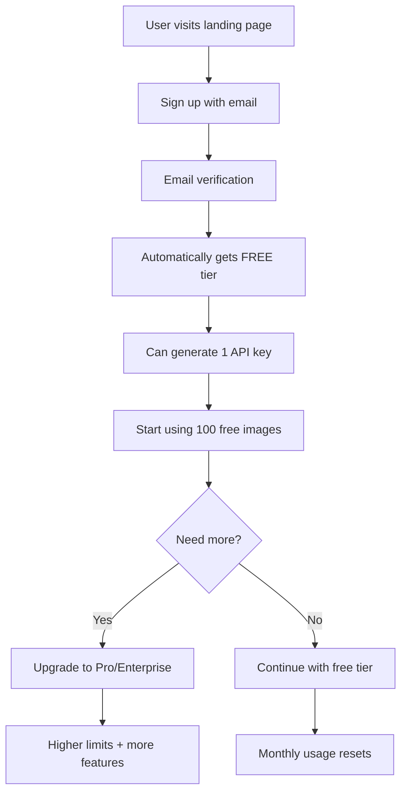

# SaaS Customer Onboarding Flow

## 🎯 Complete Customer Journey

### **Step 1: User Registration**
```bash
curl -X POST https://stylize-mcp-server.com/auth/register \
  -H "Content-Type: application/json" \
  -d '{
    "email": "user@example.com",
    "password": "securepass123",
    "first_name": "John",
    "last_name": "Doe",
    "company": "Acme Corp"
  }'

# Response: JWT token + user profile
{
  "access_token": "eyJ0eXAiOiJKV1QiLCJhbGciOiJIUzI1NiJ9...",
  "token_type": "bearer",
  "expires_in": 86400,
  "user": {
    "user_id": "user-abc123",
    "email": "user@example.com",
    "first_name": "John",
    "last_name": "Doe",
    "subscription_tier": "free",
    "is_active": true
  }
}
```

### **Step 2: User Login**
```bash
curl -X POST https://stylize-mcp-server.com/auth/login \
  -H "Content-Type: application/json" \
  -d '{
    "email": "user@example.com",
    "password": "securepass123"
  }'
```

### **Step 3: Check Usage & Limits**
```bash
curl -H "Authorization: Bearer JWT_TOKEN" \
  https://stylize-mcp-server.com/user/usage

# Response:
{
  "usage": {
    "user_id": "user-abc123",
    "current_month_usage": 5,
    "total_usage": 5,
    "api_key_count": 1,
    "last_usage_at": "2024-01-15T10:30:00Z"
  },
  "limits": {
    "monthly_images": 100,
    "max_api_keys": 1,
    "available_styles": ["van_gogh", "pixel_art", "flat_ui_icon"],
    "priority_support": false,
    "custom_styles": false
  },
  "subscription_tier": "free"
}
```

### **Step 4: Generate API Key**
```bash
curl -H "Authorization: Bearer JWT_TOKEN" \
  -X POST https://stylize-mcp-server.com/user/api-keys \
  -H "Content-Type: application/json" \
  -d '{
    "name": "My App Integration"
  }'

# Response (API key shown only once!):
{
  "key_id": "user-abc123-def456",
  "name": "My App Integration",
  "api_key": "64-character-hex-api-key-here",
  "created_at": "2024-01-15T10:30:00Z"
}
```

### **Step 5: Use API with Generated Key**
```bash
curl -H "Authorization: Bearer USER_API_KEY" \
  -X POST https://stylize-mcp-server.com/stylize_image \
  -F "style_id=van_gogh" \
  -F "user_prompt=a beautiful landscape"
```

## 🏆 Subscription Tiers

### **Free Tier** (Default)
- ✅ 100 images/month
- ✅ 1 API key
- ✅ 3 basic styles
- ✅ Community support
- ❌ No MCP access
- ❌ No custom styles

### **Pro Tier** ($19/month)
- ✅ 1,000 images/month
- ✅ 5 API keys
- ✅ All 5 styles
- ✅ MCP protocol access
- ✅ Priority support
- ✅ Custom style creation

### **Enterprise Tier** ($99/month)
- ✅ 10,000 images/month
- ✅ Unlimited API keys
- ✅ All styles + custom
- ✅ Full MCP access
- ✅ Dedicated support
- ✅ SLA guarantees
- ✅ Custom branding

## 🔐 Authentication Methods

### **For Users (Web/Mobile Apps)**
- JWT tokens from `/auth/login`
- 24-hour expiration
- Automatic subscription limit enforcement

### **For Integrations (API Keys)**
- User-generated API keys from `/user/api-keys`
- Inherit user's subscription limits
- Can be revoked by user

### **For Admins (Admin API Keys)**
- Admin-generated keys via `/admin/api-keys`
- Full permissions
- For internal/B2B use

## 🚀 Customer Onboarding Flow



## 💳 Billing Integration (Future)

### **Stripe Integration Points**
- `/auth/register` → Create Stripe customer
- `/user/upgrade` → Create subscription
- `/user/downgrade` → Modify subscription
- Webhook → Update user tier in Firestore

### **Usage-Based Billing**
- Track usage in Firestore
- Monthly billing cycles
- Overage charges for enterprise
- Grace period for limit exceeded

## 🎯 Key Benefits vs Current Admin System

| Feature | Admin System | SaaS System |
|---------|-------------|-------------|
| User Registration | Manual admin creation | Self-service signup |
| API Keys | Admin creates | Users create own |
| Usage Limits | None | Tier-based limits |
| Billing | Manual | Automated |
| Scalability | Low | High |
| Customer Experience | Poor | Excellent |

## 🔧 Implementation Status

✅ **Completed**
- User registration & login
- JWT authentication
- Subscription tiers & limits
- Self-service API key generation
- Usage tracking & enforcement
- Mixed auth (JWT + API keys)

🚧 **In Progress**
- Email verification
- Subscription upgrade/downgrade
- Billing integration
- User dashboard UI

📋 **Planned**
- Password reset
- Email notifications
- Admin analytics dashboard
- Webhook integrations
- Mobile SDK

This system transforms your API from an internal tool to a scalable SaaS platform! 🎉