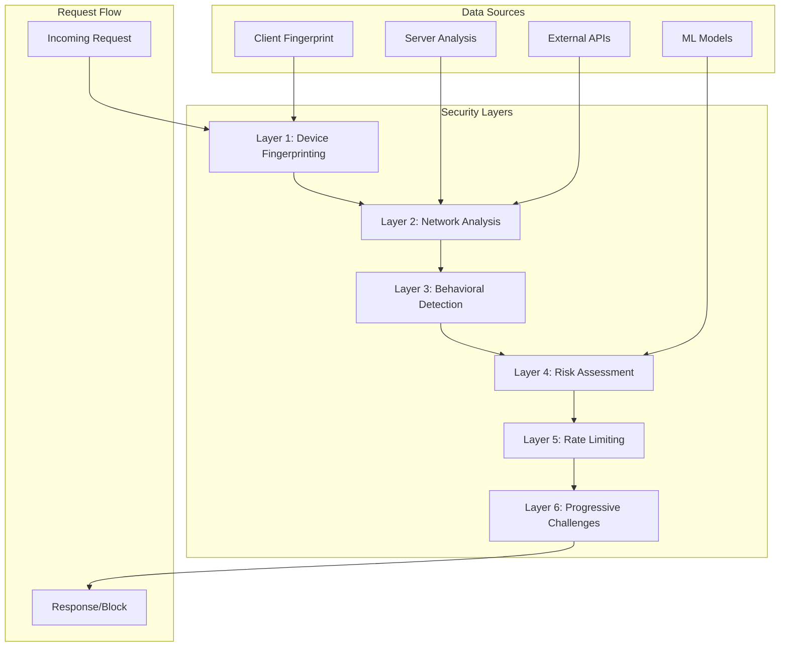

# Security Architecture Design

Detailed security architecture documentation for the Stylize MCP Server's multi-layered abuse prevention system.

## Security Design Philosophy

### Core Principles

**Zero-Friction Security**: Legitimate users experience no additional steps while malicious actors face progressive resistance.

**Defense in Depth**: Multiple independent security layers provide redundant protection against different attack vectors.

**Privacy by Design**: Minimal data collection with automatic expiration and cryptographic anonymization.

**Graceful Degradation**: Security system operates effectively even when external components are unavailable.

**Adaptive Response**: Risk-based escalation provides appropriate challenges based on threat assessment.

## Security Architecture Overview

### Multi-Layer Defense Model



### Security Component Architecture

**Core Security Services:**
1. **Device Fingerprinting Service** - Unique device identification
2. **VPN Detection Service** - Connection source analysis
3. **Behavioral Analysis Service** - Human vs. automation detection
4. **Risk Scoring Service** - ML-based threat assessment
5. **Rate Limiting Service** - Multi-dimensional usage controls
6. **Abuse Monitoring Service** - Real-time event tracking and alerting

## Layer 1: Device Fingerprinting

### Client-Side Fingerprinting (`app/static/js/fingerprint.js`)

**Browser Signature Collection:**
```javascript
Fingerprint Components:
├── Canvas Fingerprinting → GPU and rendering differences
├── WebGL Fingerprinting → Graphics card signatures
├── Screen Resolution → Display characteristics
├── Timezone Detection → Geographic indicators
├── Language Preferences → Locale settings
├── Plugin Enumeration → Browser extension fingerprints
├── Font Detection → Available system fonts
└── Hardware Concurrency → CPU core count
```

**Anti-Spoofing Measures:**
- **Entropy Analysis**: Detect artificially random values
- **Consistency Checking**: Validate component relationships
- **Timing Analysis**: Measure calculation times for authenticity
- **Behavioral Validation**: Correlate with user interactions

### Server-Side Fingerprinting (`app/fingerprint_service.py`)

**Request Analysis:**
```python
Server Fingerprint Components:
├── IP Address Analysis → Geographic and network patterns
├── User Agent Parsing → Browser and OS characteristics
├── Header Fingerprinting → HTTP header patterns
├── TLS Fingerprinting → Connection characteristics
├── Request Timing → Network latency patterns
└── Protocol Analysis → HTTP version and features
```

**Implementation:**
```python
class DeviceFingerprintService:
    def generate_composite_fingerprint(self, request: Request, client_fp: str) -> str:
        """Combine client and server fingerprints"""
        components = [
            self._hash_client_fingerprint(client_fp),
            self._analyze_request_headers(request),
            self._extract_network_fingerprint(request),
            self._calculate_timing_signature(request)
        ]
        return self._cryptographic_hash(components)
    
    def detect_fingerprint_spoofing(self, fingerprint: str, metadata: dict) -> float:
        """Return spoofing probability (0.0-1.0)"""
        return self._entropy_analysis(fingerprint) * self._consistency_check(metadata)
```

## Layer 2: Network Analysis

### VPN and Proxy Detection (`app/vpn_detection_service.py`)

**Multi-Source Detection:**
```python
Detection Methods:
├── Commercial APIs → IPQualityScore, ProxyCheck.io (95% accuracy)
├── Known IP Ranges → Datacenter and VPN provider lists
├── ASN Analysis → Autonomous System Number patterns
├── Geographic Analysis → IP location consistency
├── Timing Analysis → Connection latency patterns
└── DNS Analysis → Reverse DNS patterns
```

**Risk Assessment:**
```python
class VPNDetectionService:
    async def assess_ip_risk(self, ip_address: str) -> IPRiskAssessment:
        """Comprehensive IP reputation analysis"""
        risk_factors = await asyncio.gather(
            self._check_commercial_apis(ip_address),
            self._check_known_ranges(ip_address),
            self._analyze_asn(ip_address),
            self._verify_geolocation(ip_address),
            self._measure_connection_quality(ip_address)
        )
        
        return IPRiskAssessment(
            is_vpn=self._aggregate_vpn_signals(risk_factors),
            is_proxy=self._aggregate_proxy_signals(risk_factors),
            risk_score=self._calculate_weighted_risk(risk_factors),
            confidence=self._assess_confidence(risk_factors)
        )
```

**Intelligent Caching:**
- **Result Caching**: 1-hour cache for API results
- **Negative Caching**: Cache clean IPs for 24 hours
- **Confidence-Based TTL**: Higher confidence = longer cache duration
- **Graceful Degradation**: Use cached results when APIs unavailable

## Layer 3: Behavioral Analysis

### Automation Detection (`app/behavior_analysis_service.py`)

**Pattern Recognition:**
```python
Behavioral Indicators:
├── Request Timing → Regular intervals indicate automation
├── Mouse Movement → Human-like vs. linear movements
├── Interaction Patterns → Natural vs. scripted behavior
├── Error Handling → How the client responds to errors
├── Resource Usage → Loading patterns and caching behavior
└── Session Progression → Natural vs. goal-oriented navigation
```

**Implementation:**
```python
class BehaviorAnalysisService:
    def analyze_request_pattern(self, session_history: List[RequestEvent]) -> float:
        """Return automation probability (0.0-1.0)"""
        scores = [
            self._analyze_timing_regularity(session_history),
            self._analyze_interaction_naturalness(session_history),
            self._analyze_error_responses(session_history),
            self._analyze_resource_usage(session_history)
        ]
        return self._weighted_average(scores)
    
    def _analyze_timing_regularity(self, events: List[RequestEvent]) -> float:
        """Detect overly regular timing patterns"""
        intervals = [e2.timestamp - e1.timestamp for e1, e2 in zip(events, events[1:])]
        
        if len(intervals) < 3:
            return 0.0
            
        variance = statistics.variance(intervals)
        mean_interval = statistics.mean(intervals)
        
        # Very low variance indicates bot-like regularity
        coefficient_of_variation = variance / mean_interval if mean_interval > 0 else 0
        return max(0, 1.0 - coefficient_of_variation * 10)
```

**Mouse Movement Analysis:**
```javascript
// Client-side behavioral tracking
class BehaviorTracker {
    trackMouseMovement() {
        document.addEventListener('mousemove', (event) => {
            this.mouseEvents.push({
                x: event.clientX,
                y: event.clientY,
                timestamp: Date.now()
            });
        });
    }
    
    analyzeNaturalness() {
        // Analyze mouse movement patterns for human-like characteristics
        const smoothness = this.calculateSmoothness();
        const acceleration = this.calculateAcceleration();
        const jitter = this.calculateJitter();
        
        return {
            naturalness_score: (smoothness + acceleration + jitter) / 3,
            confidence: this.mouseEvents.length / 100
        };
    }
}
```

## Layer 4: Risk Assessment

### ML-Based Risk Scoring (`app/risk_scoring_service.py`)

**Feature Engineering:**
```python
Risk Assessment Features:
├── Temporal Features → Time of day, session duration, request frequency
├── Geographic Features → IP location, timezone consistency, travel patterns
├── Technical Features → User agent entropy, fingerprint uniqueness
├── Behavioral Features → Interaction patterns, error rates, navigation flow
├── Network Features → Connection quality, ASN reputation, IP history
└── Historical Features → Previous sessions, abuse patterns, success rates
```

**Risk Model Implementation:**
```python
class RiskScoringService:
    def __init__(self):
        self.feature_weights = {
            'vpn_detected': 0.3,
            'fingerprint_spoofed': 0.25,
            'timing_regularity': 0.2,
            'geographic_anomaly': 0.15,
            'technical_inconsistency': 0.1
        }
    
    def calculate_risk_score(self, session: TrialSession, context: RequestContext) -> RiskScore:
        """Calculate comprehensive risk score (0.0-1.0)"""
        features = self._extract_features(session, context)
        
        # Weighted combination of risk factors
        base_score = sum(
            feature_value * self.feature_weights.get(feature_name, 0.1)
            for feature_name, feature_value in features.items()
        )
        
        # Apply confidence adjustment
        confidence = self._calculate_confidence(features)
        adjusted_score = base_score * confidence
        
        return RiskScore(
            score=min(1.0, adjusted_score),
            confidence=confidence,
            factors=features,
            explanation=self._generate_explanation(features)
        )
```

**Dynamic Threshold Adjustment:**
```python
class AdaptiveThresholds:
    def adjust_thresholds(self, recent_events: List[AbuseEvent]) -> dict:
        """Dynamically adjust risk thresholds based on threat patterns"""
        
        # Analyze recent abuse patterns
        abuse_rate = self._calculate_abuse_rate(recent_events)
        false_positive_rate = self._calculate_false_positive_rate(recent_events)
        
        # Adjust thresholds based on current threat landscape
        if abuse_rate > 0.1:  # High abuse detected
            return {
                'high_risk_threshold': max(0.5, self.base_threshold - 0.1),
                'captcha_threshold': max(0.4, self.captcha_threshold - 0.1)
            }
        elif false_positive_rate > 0.02:  # Too many false positives
            return {
                'high_risk_threshold': min(0.9, self.base_threshold + 0.1),
                'captcha_threshold': min(0.8, self.captcha_threshold + 0.1)
            }
        
        return self._get_default_thresholds()
```

## Layer 5: Rate Limiting

### Multi-Dimensional Rate Limiting (`app/rate_limiting_service.py`)

**Rate Limit Dimensions:**
```python
Rate Limit Types:
├── Per-IP Limits → Prevent single IP abuse
├── Per-Device Limits → Track across device fingerprints
├── Per-Session Limits → Standard trial limits
├── Global Limits → Protect against coordinated attacks
├── Risk-Based Limits → Stricter limits for high-risk users
└── Burst Protection → Prevent rapid consumption
```

**Implementation:**
```python
class AdvancedRateLimiter:
    def __init__(self, redis_client):
        self.redis = redis_client
        self.limit_configs = {
            'trial_creation_per_ip': LimitConfig(count=3, window=3600, burst=1),
            'trial_creation_per_device': LimitConfig(count=1, window=3600, burst=0),
            'image_generation_per_session': LimitConfig(count=5, window=86400, burst=2),
            'api_requests_per_minute': LimitConfig(count=60, window=60, burst=10)
        }
    
    async def check_rate_limit(self, identifier: str, action: str, risk_multiplier: float = 1.0) -> RateLimitResult:
        """Check rate limits with risk-based adjustment"""
        config = self.limit_configs[action]
        adjusted_limit = int(config.count / risk_multiplier)
        
        # Sliding window implementation
        current_window = int(time.time() / config.window)
        previous_window = current_window - 1
        
        # Get counts for current and previous windows
        current_count = await self._get_window_count(identifier, action, current_window)
        previous_count = await self._get_window_count(identifier, action, previous_window)
        
        # Calculate weighted count for sliding window
        weight = (time.time() % config.window) / config.window
        weighted_count = current_count + (previous_count * (1 - weight))
        
        if weighted_count >= adjusted_limit:
            return RateLimitResult(
                allowed=False,
                retry_after=self._calculate_retry_after(config, weighted_count),
                current_usage=int(weighted_count),
                limit=adjusted_limit
            )
        
        # Increment counter
        await self._increment_counter(identifier, action, current_window, config.window)
        return RateLimitResult(allowed=True)
```

**Burst Protection:**
```python
class BurstProtection:
    async def check_burst_limit(self, identifier: str, action: str) -> bool:
        """Prevent rapid successive requests"""
        last_request_time = await self.redis.get(f"last_request:{action}:{identifier}")
        
        if last_request_time:
            time_since_last = time.time() - float(last_request_time)
            min_interval = self._get_minimum_interval(action)
            
            if time_since_last < min_interval:
                return False
        
        await self.redis.set(f"last_request:{action}:{identifier}", time.time(), ex=60)
        return True
```

## Layer 6: Progressive Challenges

### CAPTCHA Integration (`app/captcha_service.py`)

**Challenge Escalation:**
```python
Progressive Challenge System:
├── Risk 0.0-0.3 → No challenge (smooth experience)
├── Risk 0.3-0.5 → Simple math problem
├── Risk 0.5-0.7 → reCAPTCHA v3 (invisible)
├── Risk 0.7-0.8 → reCAPTCHA v2 (checkbox)
├── Risk 0.8-0.9 → hCAPTCHA (image challenges)
└── Risk 0.9+ → Email verification required
```

**Implementation:**
```python
class CAPTCHAService:
    async def determine_challenge_level(self, risk_score: float, session_history: List) -> ChallengeLevel:
        """Select appropriate challenge based on risk and history"""
        
        # Adjust based on previous successful challenges
        successful_challenges = len([h for h in session_history if h.challenge_passed])
        risk_adjustment = max(0, risk_score - (successful_challenges * 0.1))
        
        if risk_adjustment < 0.3:
            return ChallengeLevel.NONE
        elif risk_adjustment < 0.5:
            return ChallengeLevel.SIMPLE_MATH
        elif risk_adjustment < 0.7:
            return ChallengeLevel.RECAPTCHA_V3
        elif risk_adjustment < 0.8:
            return ChallengeLevel.RECAPTCHA_V2
        elif risk_adjustment < 0.9:
            return ChallengeLevel.HCAPTCHA
        else:
            return ChallengeLevel.EMAIL_VERIFICATION
    
    async def validate_challenge_response(self, challenge_type: ChallengeLevel, response: str, context: dict) -> ValidationResult:
        """Validate challenge response with appropriate service"""
        
        if challenge_type == ChallengeLevel.SIMPLE_MATH:
            return self._validate_math_challenge(response, context)
        elif challenge_type in [ChallengeLevel.RECAPTCHA_V2, ChallengeLevel.RECAPTCHA_V3]:
            return await self._validate_recaptcha(response, context)
        elif challenge_type == ChallengeLevel.HCAPTCHA:
            return await self._validate_hcaptcha(response, context)
        elif challenge_type == ChallengeLevel.EMAIL_VERIFICATION:
            return await self._validate_email(response, context)
```

## Real-Time Monitoring and Response

### Abuse Monitoring (`app/abuse_monitoring_service.py`)

**Event Detection:**
```python
Monitored Events:
├── Threshold Violations → Rate limits, risk scores
├── Pattern Anomalies → Unusual usage patterns
├── Geographic Anomalies → Unexpected location changes
├── Technical Anomalies → Fingerprint inconsistencies
├── Behavioral Anomalies → Automation detection
└── Challenge Failures → Repeated CAPTCHA failures
```

**Real-Time Response:**
```python
class AbuseMonitoringService:
    async def process_security_event(self, event: SecurityEvent) -> List[SecurityAction]:
        """Process security events and determine appropriate responses"""
        
        actions = []
        
        # Immediate response based on event severity
        if event.severity == Severity.CRITICAL:
            actions.append(SecurityAction.BLOCK_IP)
            actions.append(SecurityAction.ALERT_SECURITY_TEAM)
        elif event.severity == Severity.HIGH:
            actions.append(SecurityAction.REQUIRE_CHALLENGE)
            actions.append(SecurityAction.LOG_FOR_REVIEW)
        elif event.severity == Severity.MEDIUM:
            actions.append(SecurityAction.INCREASE_MONITORING)
        
        # Pattern-based responses
        recent_events = await self._get_recent_events(event.identifier, hours=1)
        if self._detect_coordinated_attack(recent_events):
            actions.append(SecurityAction.ESCALATE_RESPONSE)
            actions.append(SecurityAction.NOTIFY_INFRASTRUCTURE_TEAM)
        
        return actions
    
    async def _detect_coordinated_attack(self, events: List[SecurityEvent]) -> bool:
        """Detect coordinated abuse attempts across multiple sessions"""
        
        # Group events by time windows
        time_windows = self._group_events_by_time(events, window_size=300)  # 5-minute windows
        
        for window_events in time_windows:
            if len(window_events) > 10:  # Spike threshold
                # Check for coordination indicators
                ip_diversity = len(set(e.ip_address for e in window_events))
                geographic_diversity = len(set(e.geolocation for e in window_events))
                
                # Low diversity suggests coordination
                if ip_diversity < len(window_events) * 0.3 or geographic_diversity < 3:
                    return True
        
        return False
```

**Automated Response System:**
```python
class AutomatedResponseSystem:
    async def execute_security_actions(self, actions: List[SecurityAction], context: SecurityContext):
        """Execute security actions with appropriate safeguards"""
        
        for action in actions:
            try:
                if action == SecurityAction.BLOCK_IP:
                    await self._add_ip_to_blocklist(context.ip_address, duration=3600)
                elif action == SecurityAction.REQUIRE_CHALLENGE:
                    await self._force_challenge_for_session(context.session_id)
                elif action == SecurityAction.ALERT_SECURITY_TEAM:
                    await self._send_security_alert(context)
                elif action == SecurityAction.ESCALATE_RESPONSE:
                    await self._escalate_to_waf(context)
                    
            except Exception as e:
                # Never let security actions break the main service
                logger.error(f"Security action {action} failed: {e}")
                await self._log_action_failure(action, context, e)
```

## Security Metrics and Analytics

### Performance Metrics

**Security Effectiveness:**
- **Abuse Detection Rate**: Percentage of abuse attempts detected
- **False Positive Rate**: Legitimate users incorrectly challenged
- **Response Time Impact**: Latency added by security checks
- **Coverage Metrics**: Percentage of requests analyzed by each layer

**Implementation Metrics:**
```python
Security Metrics Collected:
├── security_checks_total{layer, result} → Counter
├── risk_score_distribution → Histogram
├── challenge_completion_rate{type} → Gauge
├── abuse_events_total{type, severity} → Counter
├── false_positive_rate → Gauge
└── security_processing_duration{layer} → Histogram
```

### Analytics Dashboard

**Real-Time Monitoring:**
```python
class SecurityMetricsCollector:
    def record_security_check(self, layer: str, result: str, duration: float, risk_score: float):
        """Record security check metrics"""
        
        # Performance metrics
        self.security_checks_counter.labels(layer=layer, result=result).inc()
        self.security_duration_histogram.labels(layer=layer).observe(duration)
        
        # Risk distribution
        self.risk_score_histogram.observe(risk_score)
        
        # Update real-time dashboard
        self._update_dashboard_metrics(layer, result, risk_score)
    
    def calculate_effectiveness_metrics(self, time_window: int = 3600) -> EffectivenessReport:
        """Calculate security system effectiveness over time window"""
        
        events = self._get_events_in_window(time_window)
        
        total_requests = len(events)
        abuse_detected = len([e for e in events if e.abuse_detected])
        false_positives = len([e for e in events if e.false_positive])
        legitimate_passed = len([e for e in events if e.legitimate and e.passed])
        
        return EffectivenessReport(
            detection_rate=abuse_detected / max(1, total_requests),
            false_positive_rate=false_positives / max(1, total_requests),
            legitimate_pass_rate=legitimate_passed / max(1, total_requests),
            overall_effectiveness=(abuse_detected + legitimate_passed) / max(1, total_requests)
        )
```

## Privacy and Compliance

### Data Protection Design

**Privacy-by-Design Principles:**
```python
Privacy Controls:
├── Data Minimization → Collect only necessary security metadata
├── Purpose Limitation → Use data only for abuse prevention
├── Storage Limitation → 24-hour automatic expiration
├── Accuracy → Regular validation and cleanup
├── Security → Encryption and access controls
├── Accountability → Audit trails and documentation
└── Transparency → Clear disclosure of security measures
```

**GDPR Compliance Implementation:**
```python
class PrivacyComplianceService:
    def anonymize_fingerprint(self, raw_fingerprint: str) -> str:
        """Create anonymized hash of device fingerprint"""
        salt = os.environ.get('FINGERPRINT_SALT', 'default-salt')
        return hashlib.sha256(f"{raw_fingerprint}{salt}".encode()).hexdigest()
    
    def schedule_data_expiration(self, session_id: str, data_type: str):
        """Schedule automatic data deletion"""
        expiration_time = datetime.utcnow() + timedelta(hours=24)
        
        self.scheduler.add_job(
            func=self._delete_security_data,
            trigger='date',
            run_date=expiration_time,
            args=[session_id, data_type],
            id=f"cleanup_{session_id}_{data_type}"
        )
    
    async def handle_data_subject_request(self, request_type: str, identifier: str) -> dict:
        """Handle GDPR data subject requests"""
        
        if request_type == 'access':
            return await self._export_subject_data(identifier)
        elif request_type == 'deletion':
            return await self._delete_subject_data(identifier)
        elif request_type == 'portability':
            return await self._export_portable_data(identifier)
```

This comprehensive security architecture provides enterprise-grade protection against abuse while maintaining user privacy and service performance. The layered approach ensures that even if individual components fail or are bypassed, the overall system maintains its protective capabilities.