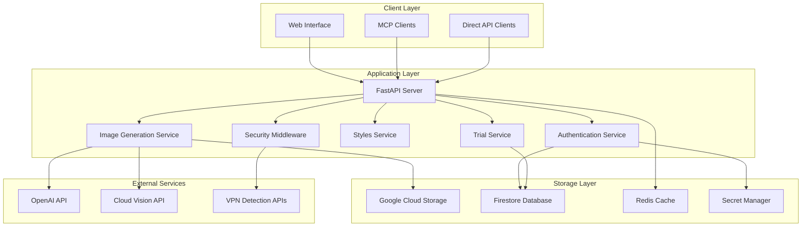

# System Architecture Overview

Comprehensive overview of the Stylize MCP Server architecture, design decisions, and system components.

## High-Level Architecture

### Service Design Philosophy

The Stylize MCP Server is built as a **cloud-native, microservices-oriented** application with the following design principles:

- **API-First**: RESTful API with OpenAPI specification as the foundation
- **Multi-Modal Access**: Web interface, MCP protocol, and direct API access
- **Freemium Business Model**: Anonymous trials with seamless upgrade paths
- **Security by Design**: Multi-layered abuse prevention without user friction
- **Scalable Infrastructure**: Auto-scaling cloud deployment with cost optimization

### System Components



## Core Services Architecture

### FastAPI Application (`app/main.py`)

**Responsibilities:**
- HTTP server and request routing
- Middleware integration (CORS, security, logging)
- API documentation generation
- Health check endpoints
- Error handling and response formatting

**Key Features:**
- Async/await for high concurrency
- Automatic OpenAPI documentation
- Request validation with Pydantic models
- Structured logging with correlation IDs

### Authentication Service (`app/auth_service.py`)

**Multi-Modal Authentication:**
```python
Authentication Methods:
├── Anonymous Trial Sessions (5 free images)
├── JWT Token Authentication (registered users)
├── API Key Authentication (developers/integrations)
└── Development Bypass (local development)
```

**Features:**
- Session-based trial tracking
- JWT token generation and validation
- API key management with permissions
- Automatic user registration flow

### Trial Service (`app/trial_service.py`)

**Trial Session Management:**
- Anonymous session creation and tracking
- Usage limit enforcement (5 images per session)
- Conversion to registered accounts
- Trial status monitoring and reporting

**Integration Points:**
- Security middleware for abuse prevention
- Firestore for session persistence
- Rate limiting for session creation
- Credit system for trial conversion

### Styles Service (`app/styles_service.py`)

**Style Catalog Management:**
```json
Style Definition Structure:
{
  "id": "van_gogh",
  "name": "Van Gogh",
  "description": "Bold, swirling brush strokes...",
  "prompt_template": "in the style of Vincent van Gogh...",
  "example_use_cases": ["art projects", "creative websites"],
  "best_for": ["artistic expression", "emotional impact"]
}
```

**Features:**
- JSON-based style catalog (`app/styles.json`)
- Template-driven prompt generation
- Style recommendation engine
- MCP resource provision

### Image Generation Service (`app/openai_service.py`)

**Two-Stage Generation Pipeline:**

1. **Context Analysis Stage** (when reference images provided):
   - GPT-4V analysis of uploaded images
   - Brand context extraction
   - Visual element identification
   - Style compatibility assessment

2. **Image Generation Stage**:
   - Template-driven prompt construction
   - DALL·E 3 API integration
   - Content safety filtering
   - Result post-processing

**Multi-Style Generation:**
```python
Single Style Request:
user_prompt + style_template → 1 image

Multi-Style Request (no style_id):
user_prompt + 4_random_styles → 4 images
```

### Security Architecture (`app/protection_middleware.py`)

**Multi-Layer Defense System:**


**Security Services:**
- **Device Fingerprinting** (`app/fingerprint_service.py`): Browser signature collection
- **VPN Detection** (`app/vpn_detection_service.py`): Multi-API proxy detection
- **Behavioral Analysis** (`app/behavior_analysis_service.py`): Automation detection
- **Risk Scoring** (`app/risk_scoring_service.py`): ML-based threat assessment
- **Rate Limiting** (`app/rate_limiting_service.py`): Multi-dimensional throttling
- **Abuse Monitoring** (`app/abuse_monitoring_service.py`): Real-time alerting

## Data Architecture

### Firestore Database Design

**Collections Structure:**
```
firestore/
├── trial_sessions/{session_id}
│   ├── ip_address, user_agent, device_fingerprint
│   ├── created_at, expires_at, images_used
│   └── risk_score, validation_challenges
├── users/{user_id}
│   ├── email, first_name, last_name, company
│   ├── subscription_tier, monthly_limit
│   └── created_at, last_login
├── user_credits/{user_id}
│   ├── total_credits, monthly_credits, purchased_credits
│   ├── current_month_usage, last_reset_date
│   └── credit_transactions[]
├── api_keys/{key_id}
│   ├── hashed_key, name, permissions[]
│   ├── user_id, is_active, created_at
│   └── last_used, usage_count
└── abuse_events/{event_id}
    ├── event_type, session_id, ip_address
    ├── timestamp, details, action_taken
    └── risk_score, confidence_level
```

### Google Cloud Storage Architecture

**Bucket Organization:**
```
gs://project-id-stylize-images/
├── generated/
│   ├── 2025/01/15/req-abc123-van_gogh.png
│   ├── 2025/01/15/req-abc124-pixel_art.png
│   └── ...
├── uploads/ (temporary user uploads)
│   ├── session-xyz/original.jpg
│   └── ...
└── cache/ (cached analysis results)
    ├── context/req-abc123.json
    └── ...
```

**Features:**
- Public read access for generated images
- Automatic lifecycle management (30-day deletion for uploads)
- CDN integration for global distribution
- Signed URLs for secure temporary access

### Redis Cache Architecture

**Cache Strategy:**
```
redis/
├── trial_sessions:{session_id} → session data (TTL: 24h)
├── rate_limit:{type}:{identifier} → usage counters (TTL: varies)
├── vpn_cache:{ip_address} → VPN detection results (TTL: 1h)
├── styles_catalog → complete styles JSON (TTL: 1d)
└── fingerprint_cache:{hash} → device fingerprints (TTL: 1h)
```

**Fallback Strategy:**
- In-memory cache when Redis unavailable
- Graceful degradation without service interruption
- Automatic reconnection and cache warming

## Integration Architecture

### Model Context Protocol (MCP) Integration

**MCP Server Implementation:**
```python
MCP Tools Available:
├── start_trial_session() → Anonymous trial creation
├── check_trial_status() → Usage monitoring
├── stylize_image() → Single/multi-style generation
├── generate_image_from_text() → Text-to-image creation
├── list_styles() → Style catalog access
└── get_style_details() → Detailed style information

MCP Resources:
└── styles://catalog → Complete styles JSON
```

**Transport Methods:**
- **Server-Sent Events (SSE)**: `/mcp/sse` - Recommended for Claude Desktop
- **JSON-RPC**: `/mcp` - Alternative transport for custom clients

### External API Integration

**OpenAI Integration:**
```python
OpenAI APIs Used:
├── GPT-4V → Image context analysis
├── DALL·E 3 → Image generation
└── Text Moderation → Content safety (backup)

Error Handling:
├── Rate limit backoff
├── Content policy violations
├── Service unavailability
└── Token limit exceeded
```

**Security API Integration:**
```python
VPN Detection APIs:
├── IPQualityScore → Premium VPN detection
├── ProxyCheck.io → Alternative VPN service
└── Free IP ranges → Fallback detection

CAPTCHA Integration:
├── Google reCAPTCHA v2/v3
└── hCAPTCHA (alternative)
```

## Deployment Architecture

### Google Cloud Platform Infrastructure

**Cloud Run Deployment:**
```yaml
Service Configuration:
  CPU: 1 vCPU
  Memory: 2 GiB
  Min instances: 1
  Max instances: 10
  Concurrency: 100
  Request timeout: 300s
```

**Auto-Scaling Strategy:**
- **CPU-based scaling**: Scale up at 70% CPU utilization
- **Request-based scaling**: Scale up at 80% concurrency
- **Minimum instances**: 1 (for low latency)
- **Maximum instances**: 10 (cost control)

**Infrastructure Components:**
```
GCP Resources:
├── Cloud Run → Application hosting
├── Cloud Storage → Image storage
├── Firestore → Database
├── Secret Manager → API keys and secrets
├── Cloud Vision → Content safety
├── Memorystore Redis → Caching (optional)
├── Cloud Monitoring → Metrics and alerting
└── Cloud Logging → Structured logging
```

### CI/CD Pipeline Architecture

**GitHub Actions Workflow:**
```yaml
Pipeline Stages:
├── Code quality checks (ruff, black, isort)
├── Unit and integration testing
├── Security scanning
├── Docker image build
├── Artifact Registry push
├── Cloud Run deployment
└── Health check verification
```

**Deployment Strategy:**
- **Blue-green deployment** via Cloud Run revisions
- **Automatic rollback** on health check failures
- **Gradual traffic migration** for safety
- **Zero-downtime deployment** with traffic splitting

## Performance Architecture

### Optimization Strategies

**Application Performance:**
- **Async/await**: Non-blocking I/O for high concurrency
- **Connection pooling**: Reuse HTTP connections to external APIs
- **Request batching**: Batch Firestore operations where possible
- **Lazy loading**: Load resources only when needed

**Caching Strategy:**
```python
Cache Levels:
├── Application Cache → In-memory Python objects
├── Redis Cache → Shared cache across instances
├── CDN Cache → Global edge caching for images
└── Browser Cache → Client-side resource caching
```

**Database Optimization:**
- **Firestore indexing**: Optimized queries for trial sessions and users
- **Batch operations**: Minimize database round trips
- **Connection pooling**: Efficient database connections
- **Query optimization**: Fetch only required fields

### Monitoring and Observability

**Metrics Collection:**
```python
Custom Metrics:
├── trial_sessions_created_total
├── images_generated_total
├── security_violations_total
├── api_response_time_histogram
├── rate_limit_violations_total
└── mcp_tool_usage_total

Health Checks:
├── /health → Basic service health
├── External API connectivity
├── Database connectivity
└── Cache availability
```

**Alerting Strategy:**
- **Error rate > 5%**: Immediate alert
- **Response time > 5s**: Warning alert
- **Security violations spike**: Security team alert
- **External API failures**: Dependency alert

## Security Architecture

### Threat Model and Mitigations

**Identified Threats:**
```python
Security Threats:
├── Trial Abuse → Multi-layered detection and prevention
├── API Abuse → Rate limiting and authentication
├── Content Violations → Automated filtering
├── DDoS Attacks → Cloud-level protection
└── Data Breaches → Encryption and access controls
```

**Security Controls:**
- **Authentication**: Multi-modal with appropriate permissions
- **Authorization**: Role-based access control
- **Encryption**: TLS in transit, encrypted storage at rest
- **Input validation**: Comprehensive request validation
- **Output sanitization**: Safe response formatting

### Privacy and Compliance

**Data Protection:**
- **Data minimization**: Collect only necessary data
- **Automatic expiration**: 24-hour session lifetimes
- **Anonymization**: Hash device fingerprints
- **Right to deletion**: Automatic data cleanup

**Compliance Features:**
- **GDPR compliance**: Privacy-by-design principles
- **Data sovereignty**: GCP region controls
- **Audit logging**: Complete activity trails
- **Consent management**: Clear data usage policies

This architecture provides a robust, scalable, and secure foundation for the Stylize MCP Server while maintaining the flexibility to evolve with changing requirements and usage patterns.